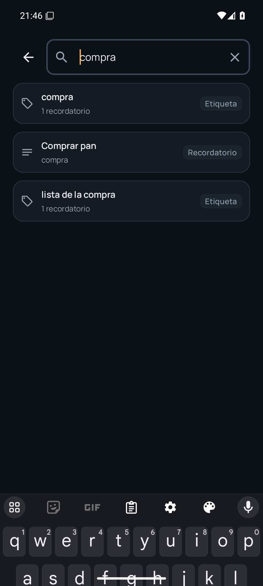
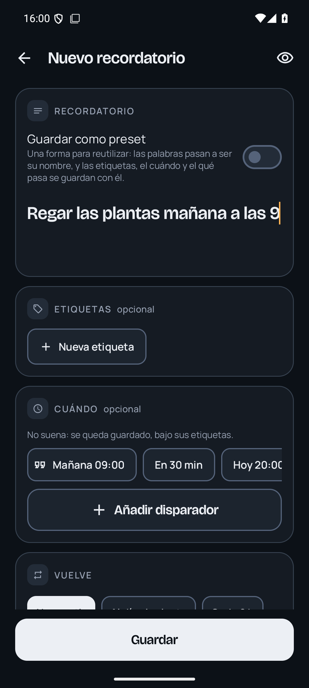
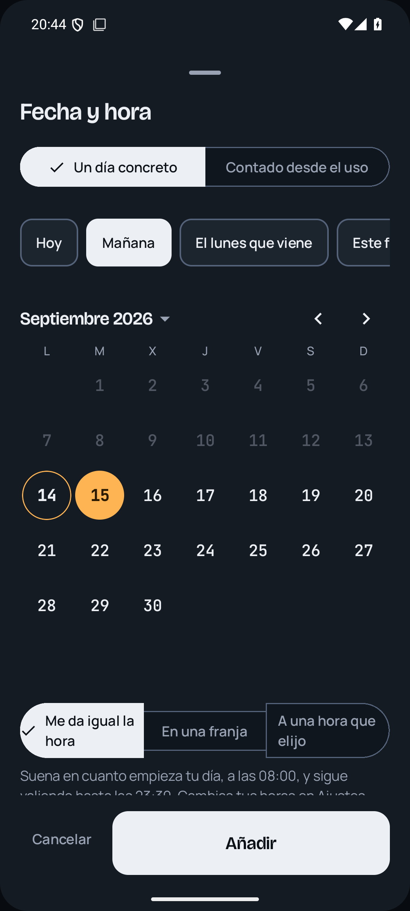
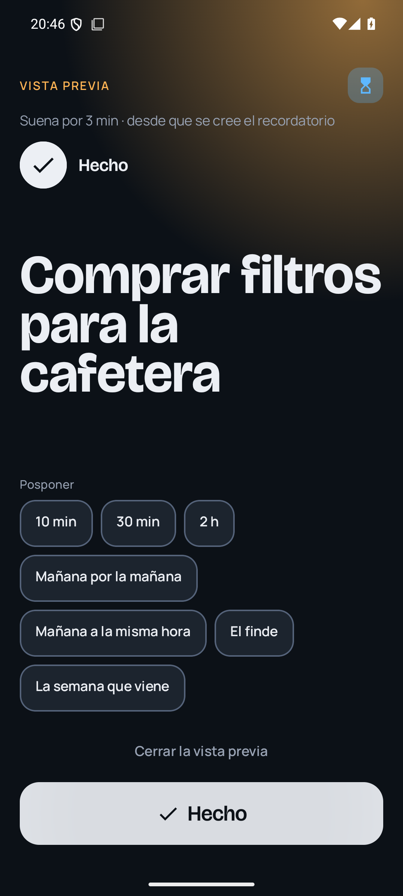

# Rwilco — everyday reminders for Android

A personal reminders app that lives entirely on your phone. Write what you want to remember,
tag it if you like, say *when* — a date, a date and time, a stretch of the day, a countdown, a
place, or a random moment; or just write it, "mañana a las 9", and take the chip that reads it
back — say whether it *comes back* (on a calendar of its own, or so long
after you deal with it), and say *what should happen*: take over the screen, notify, sound,
vibrate. When it rings, put it off until later — or until you get home, or leave here.

Dark-first, built for one hand, no account, no server, nothing leaves the device.

<table>
  <tr>
    <td></td>
    <td></td>
    <td></td>
    <td></td>
    <td></td>
    <td></td>
    <td></td>
    <td></td>
  </tr>
</table>

## Download

Point your phone's camera at this code, or tap the link below.

**[github.com/olemoudi/rwilco/releases/latest/download/rwilco.apk](https://github.com/olemoudi/rwilco/releases/latest/download/rwilco.apk)**

Android 10 or newer. Your phone will warn you that the file comes from outside the Play Store,
and Play Protect may offer to scan it first — that is normal for any app installed this way.

That link is always the newest **beta**, which is the one to install: it is the tested channel,
and it is where the app keeps itself up to date from afterwards. Settings → Updates also offers
an **alpha** channel — builds as they are written, which nobody else has run yet. It is there for
the author, and coming back from it is not immediate, because Android will not install an older
version over a newer one. Unless you want to be a test pilot, stay on beta.

## Status

Reminders fire: exact alarms, a full-screen alert over the lock screen, notifications with
"Done" and "Snooze", and place triggers through geofencing. A reminder can be fenced in —
*arriving home, and only between six and ten* — and what you have written before is offered
back instead of a blank keyboard.

Verified on an emulator; the place triggers are the part that only a real phone in a real street
can really prove.

## Honest limitations

- The place picker's map tiles need a connection; without one the pin still works, over a
  blank map. The rest of the app never needs a connection (except to check for updates).
- No sync. Backup is optional and off by default: an encrypted copy (your passphrase, sealed on
  the phone) in a private GitHub repository of yours, refreshed after every change. Without it,
  what is on the phone is the only copy.
- Place reminders need location "all the time" and Play Services; without them the rest of the
  app is unaffected and Settings says so.

## Building

`./gradlew :app:assembleDebug` builds a debug APK signed with the same key as the releases, so
it installs over a release without uninstalling. `./gradlew test` runs the JVM suites;
`scripts/emu.sh` drives a headless emulator for the on-device ones.
