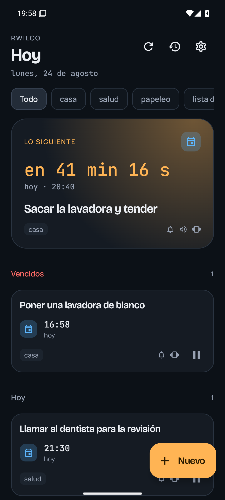
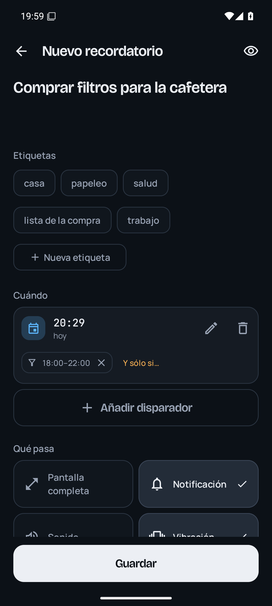
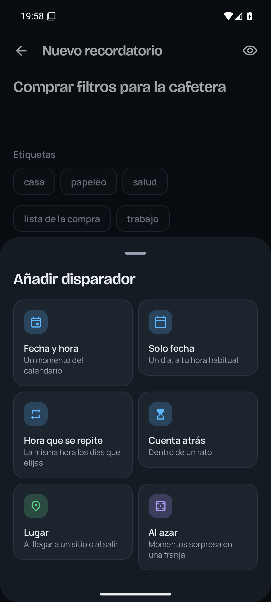
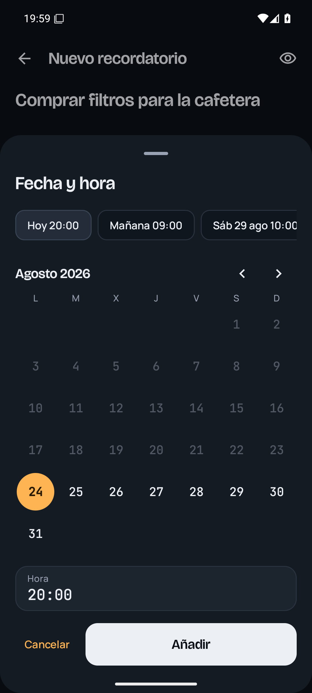
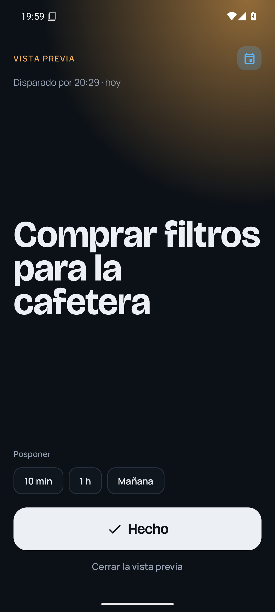
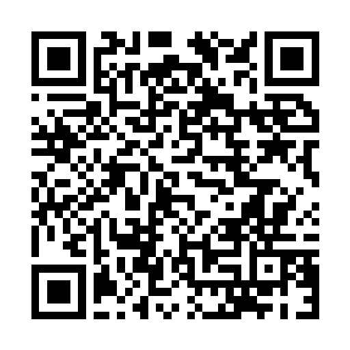

# Rwilco — everyday reminders for Android

A personal reminders app that lives entirely on your phone. Write what you want to remember,
tag it if you like, say *when* — a date, a date and time, a time that repeats, a countdown, a
place, or a random moment — and say *what should happen*: take over the screen, notify, sound,
vibrate.

Dark-first, built for one hand, no account, no server, nothing leaves the device.

<table>
  <tr>
    <td></td>
    <td></td>
    <td></td>
    <td></td>
    <td></td>
  </tr>
</table>

## Download

Point your phone's camera at this code, or tap the link below.

**[github.com/olemoudi/rwilco/releases/latest/download/rwilco.apk](https://github.com/olemoudi/rwilco/releases/latest/download/rwilco.apk)**

Android 10 or newer. Your phone will warn you that the file comes from outside the Play Store,
and Play Protect may offer to scan it first — that is normal for any app installed this way.
Once installed, Rwilco keeps itself up to date from this same page.

## Status

Reminders fire: exact alarms, a full-screen alert over the lock screen, notifications with
"Done" and "Snooze", and place triggers through geofencing. A reminder can be fenced in —
*arriving home, and only between six and ten* — and what you have written before is offered
back instead of a blank keyboard.

Verified on an emulator; the place triggers are the part that only a real phone in a real street
can really prove.

## Honest limitations

- The place picker's map tiles need a connection; without one the pin still works, over a
  blank map. The rest of the app never needs a connection (except to check for updates).
- No sync or backup: what is on the phone is the only copy.
- Place reminders need location "all the time" and Play Services; without them the rest of the
  app is unaffected and Settings says so.

## Building

`./gradlew :app:assembleDebug` builds a debug APK signed with the same key as the releases, so
it installs over a release without uninstalling. `./gradlew test` runs the JVM suites;
`scripts/emu.sh` drives a headless emulator for the on-device ones.
